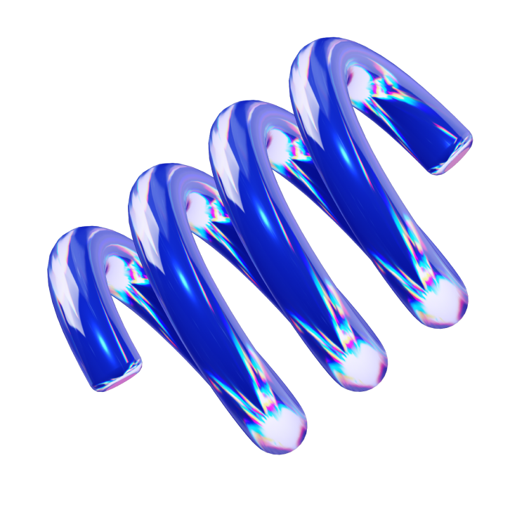

  

#  About Me

I'm a Computer Science student passionate about software engineering, front-end design, and ethical technology. I am pursuing an education in order to advance future capabilities in the industrial and mechanical landscape.

#  Tech Stack

    
    
    
    
    
    
    
    
    
    
    
    
    

#  Github Statistics

#  Wisdom
> "What we know is not much. What we don't know is enormous."

— Pierre Simon De Laplace

#  Trophies

